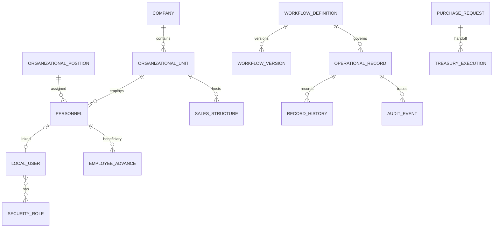

# فرهنگ داده و روابط مفهومی

> **وضعیت:** `Verified` بر اساس `model.ts`، `storage.ts`، `storeRegistry.ts` و payloadهای دامنه‌ای. این سند schema منطقی است؛ IndexedDB کلید خارجی فیزیکی ندارد.

## مشخصات پایگاه محلی

| مورد | مقدار |
|---|---|
| نام | `tapra2_local` |
| نسخه schema | `9` |
| نسخه seed | `complete-local-erp-v1.20-versioned-workflow-editing` |
| تعداد store | `95` |
| کلید پایه | `id` در همه storeها |
| migration | ایجاد store/index هنگام upgrade؛ migration معنایی payload وجود ندارد |
| transaction | `StorageAdapter.transaction(stores, mode, work)` |

## ER مفهومی

روابط بالا در Service با شناسه کنترل می‌شوند و FK/unique constraint فیزیکی در IndexedDB ندارند.

## هویت و سازمان

| Entity / Store | فیلدهای کلیدی | حساسیت | چرخه عمر و قواعد |
|---|---|---|---|
| `LocalUser` / `users` | `username`, `passwordHash`, `roleIds`, grants/denials, company/unit/team, status | بالا | غیرفعال‌سازی soft؛ ادمین اصلی قابل غیرفعال‌سازی نیست. |
| `FoundationSession` / `sessions` | active user، acting admin، زمان QA، version | بالا | یک رکورد `active-session`؛ در IndexedDB نه Cookie/JWT. |
| `SecurityRole` / `security_roles` | name، scope، permissions، protected، version | متوسط | نقش محافظت‌شده حذف نمی‌شود؛ نسخه قبلی در `role_versions`. |
| `OrganizationalUnit` / `organizational_units` | name، type، parent، manager، order، status | متوسط | واحد و شعبه یک entity با type متفاوت؛ غیرفعال‌سازی soft. |
| `OrganizationalPosition` / `organizational_positions` | title، description، status | کم | حذف فقط با رعایت ارجاعات سرویس. |
| `PersonnelRecord` / `personnel` | کد، کدملی، تماس، نشانی، استخدام، واحد، سمت، شعبه، بانک | بسیار بالا | کد پرسنلی تولید سامانه؛ جابه‌جایی در history؛ پایان همکاری soft. |
| `PersonnelMovement` | kind، from/to، effectiveDate، reason، actor | بالا | append-only در پرونده؛ انتقال شعبه/واحد/سمت/فروش. |
| `PersonnelProfileChangeRequest` | requester، changed fields، reason، status، reviewer | بالا | self-service؛ اعمال نهایی فقط پس از review. |
| `SalesStructure` / `sales_structures` | branch، vice، manager، senior، call-center supervisor، version | متوسط | پس از انتصاب قفل معنایی؛ ساختار غیرفعال در انتخاب جدید نمایش داده نمی‌شود. |

## مجوز، Workflow و رویداد

| Entity / Store | فیلدهای کلیدی | قاعده |
|---|---|---|
| `PermissionCatalogItem` | `domain.resource.action`، label، availability | منبع UI انتخاب مجوز. |
| `PolicyDefinition` | kind، version، enabled | تعریف سطح بالا؛ اجرای واقعی در Guardهای کد است. |
| `WorkflowDefinition` | states، transitions، queue، assignment، stages، variants | state machine محافظت‌شده؛ routing قابل نسخه‌گذاری. |
| `workflow_versions` | snapshot کامل نسخه | پرونده قدیمی از همین نسخه استفاده می‌کند. |
| `OperationalRecord` | module، trackingCode، status، owner/assignee، amount، payload، version | optimistic concurrency با expectedVersion؛ route/version هنگام ایجاد freeze می‌شود. |
| `OperationalRecordHistory` | sequence، eventType، from/to، actor، snapshot | تاریخچه append-only منطقی. |
| `AuditEvent` | actor، effectiveUser، outcome، correlation، metadata | ثبت رخداد امنیتی/عملیاتی؛ append-only منطقی. |
| `DomainEvent` | aggregate، eventType، payload، correlation | رخداد محلی برای projection/trace؛ broker خارجی نیست. |
| `UserNotification` | user، kind، related record، dedupeKey، readAt | اعلان کاربر؛ index روی user/date/dedupe. |
| `idempotency_keys` | key، record، createdAt | جلوگیری از تکرار انتقال در عملیات پشتیبانی‌شده. |

## Payload درخواست خرید

| فیلد | نوع/فرمت | الزام | داده حساس |
|---|---|---|---|
| `requestDate` | جلالی `YYYY/MM/DD` در UI | بله | خیر |
| `purchaseType` | goods/service/mixed | بله | خیر |
| `lines[]` | شرح، گروه، مشخصات، مقدار، واحد، قیمت، supplier | حداقل یک ردیف | خیر |
| `quotationAttachments[]` | نام، MIME، size، data URL، زمان | اختیاری | ممکن است |
| `beneficiaryCardNumber` | ۱۶ رقم | بله | بسیار بالا |
| `beneficiaryLastName` | متن | بله | متوسط |
| `allocations[]` | شعبه، مرکز هزینه، مبلغ، یادداشت | حداقل یک سهم | مالی |

جمع تخصیص‌ها باید دقیقاً برابر مجموع ردیف‌ها باشد. attachment داخل IndexedDB و snapshot می‌رود؛ quota رسمی `Unknown` است.

## Payload مساعده

| گروه | فیلدهای ثابت‌شده |
|---|---|
| ذی‌نفع | personnel/user id، کد پرسنلی، نام، کدملی، موبایل |
| جایگاه | شعبه، واحد، سمت |
| مالی | بانک، شماره کارت، مبلغ اولیه و مصوب، اعتبار داخلی |
| نیابتی | ثبت نیابتی، ثبت‌کننده نیابتی، self approval |
| امضا | کاربر امضاکننده، نام، زمان |
| Trail | مرحله، عمل، actor، زمان، reason، مبلغ قبل/بعد |

## طبقه‌بندی داده

| سطح | نمونه | کنترل فعلی | کمبود |
|---|---|---|---|
| بسیار حساس | password hash، کارت، شبا، کدملی | hash، permission، masking UI، backup اختیاری رمزدار | encryption-at-rest مرورگر تضمین نشده |
| حساس | نشانی، موبایل، اسناد، تاریخچه شغلی | permission + audit | retention/redaction مصوب نیست |
| داخلی | نقش، ساختار، workflow، audit | scope + backup | امضای دیجیتال قانونی وجود ندارد |
| عمومی داخلی | کاتالوگ و عنوان‌ها | permission عمومی | طبقه‌بندی رسمی داده `Planned` |

## Index و Query

فقط indexهای صریح زیر وجود دارند:

- `audit_events`: `occurredAt`, `actorId`, `category`
- `domain_events`: `aggregateId`
- `notifications`: `userId`, `createdAt`, `dedupeKey`

`Implemented-Unverified` — جست‌وجو و sort بیشتر جدول‌ها پس از `getAll` در حافظه انجام می‌شود. برای ۵۰۰ کاربر احتمالاً قابل قبول است، اما benchmark رسمی وجود ندارد.

## حذف، نگه‌داری و بازیابی

- `Verified` — کاربران/واحدها/ساختارها عمدتاً غیرفعال می‌شوند و تاریخچه حفظ می‌شود.
- `Verified` — reset کل دیتابیس را با seed قطعی جایگزین می‌کند؛ داده قبلی بدون backup از دست می‌رود.
- `Verified` — import snapshot پس از اعتبارسنجی schema/store/checksum کل داده را جایگزین می‌کند.
- `Unknown` — retention، legal hold، quota attachment و حذف امن داده شخصی تصویب نشده‌اند.

