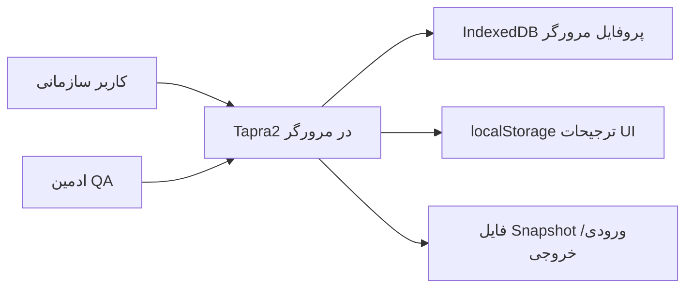
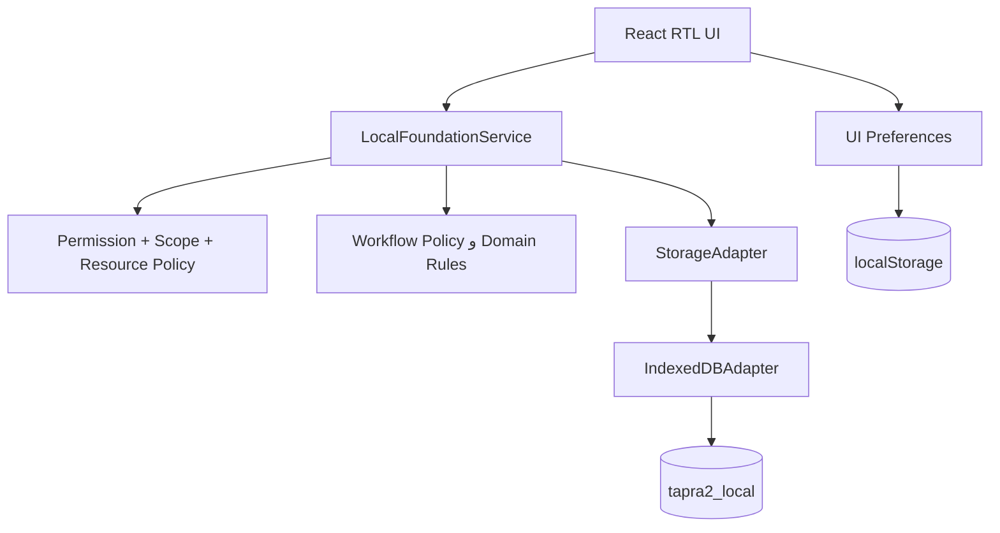
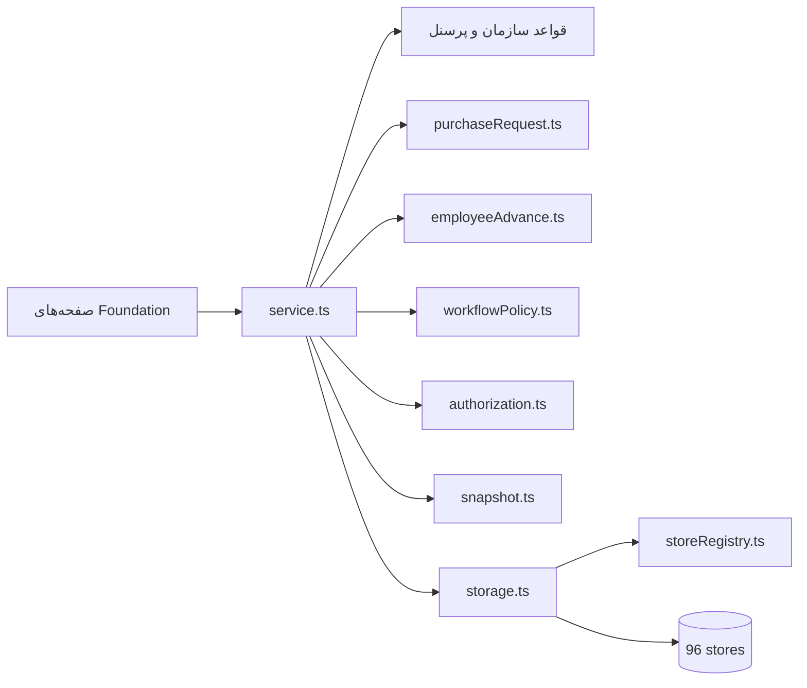
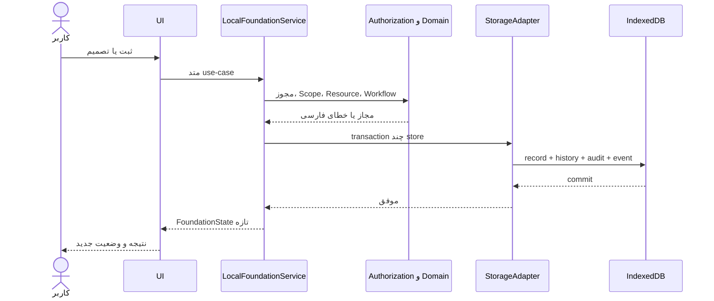
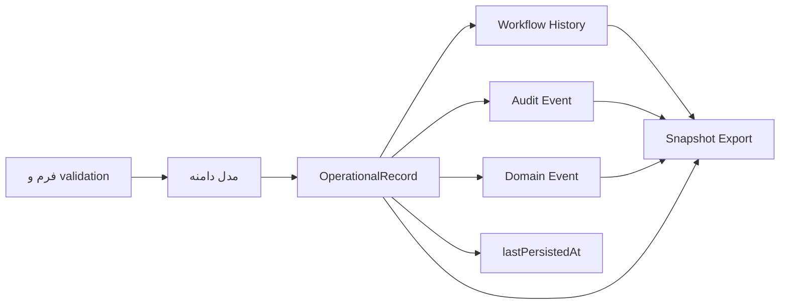
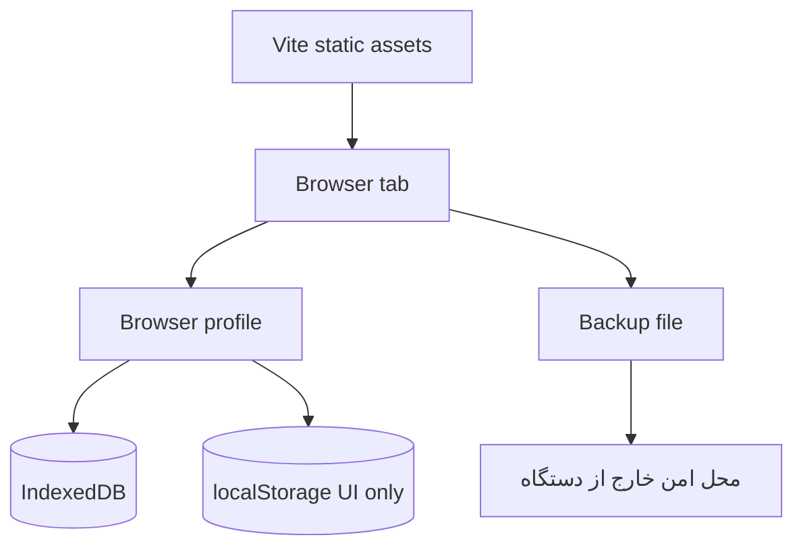

# نمودارهای معماری قابل تطبیق با کد

> **وضعیت:** `Verified` — نمودارها فقط runtime فعال Browser-local را نشان می‌دهند.

## ۱. System Context

هیچ Server، API، PostgreSQL یا سرویس SMS واقعی در context جاری وجود ندارد.

## ۲. Container

## ۳. Component

## ۴. Request Sequence

## ۵. Data Flow

## ۶. Deployment

## مرزهای اعتماد و نقاط شکست

| مرز/نقطه | وضعیت | پیامد |
|---|---|---|
| ورودی UI به Service | validation و permission | UI قابل اعتماد فرض نمی‌شود. |
| Service به IndexedDB | transaction محلی | خرابی tab وسط transaction باید rollback شود. |
| پروفایل مرورگر | نقطه شکست یکتا | حذف profile/device بدون backup باعث از دست‌رفتن داده می‌شود. |
| Snapshot file | خارج از مرز برنامه | فایل ساده ممکن است داده بسیار حساس داشته باشد. |
| چند tab | optimistic concurrency | merge فیلدی وجود ندارد؛ refresh/retry لازم است. |

## محدودیت معماری

- `Verified` — operational data فقط IndexedDB است.
- `Verified` — localStorage فقط preference است.
- `Verified` — UI نباید مستقیم IndexedDB را صدا بزند.
- `Unknown` — مقیاس، latency و quota روی دستگاه‌های واقعی benchmark نشده است.
- `Planned` — جایگزینی Adapter با API سرور بدون بازطراحی workflow/UI.

