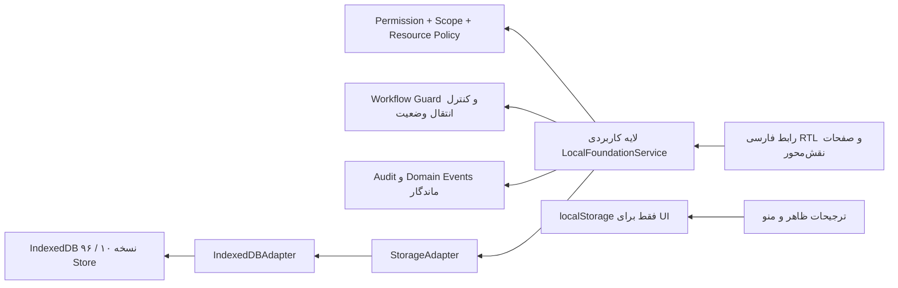
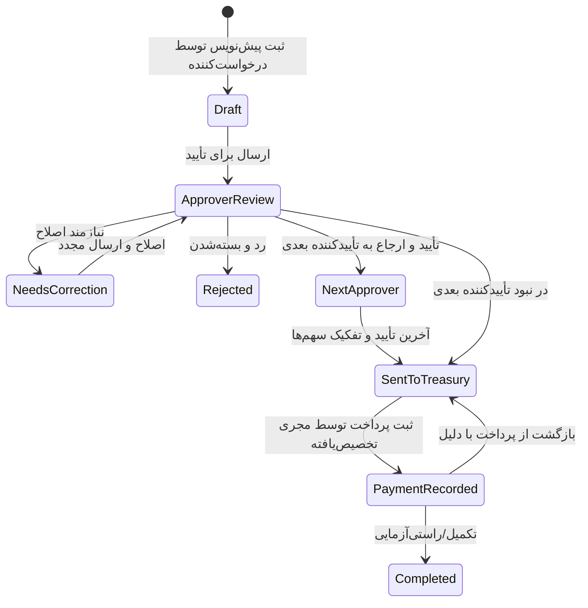
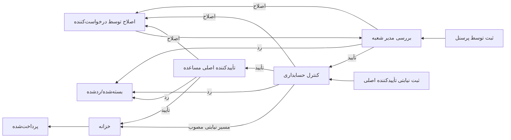

# ممیزی جامع فلوهای محصول تپرا

تاریخ ممیزی: ۲۰۲۶-۰۸-۲۲  
شاخه بررسی‌شده: `feature/workflow-management`  
مبنای کد: `83210f6` به‌علاوه تغییرات تأییدنشدهٔ موجود در Worktree  
محیط اجرا: مرورگر محلی، IndexedDB، بدون API یا سرور کاربردی

## خلاصه مدیریتی

نسخه فعال محصول واقعاً از ورودی `src/App.tsx` به `LocalFoundationApp` متصل است. مسیر فعال از API، PostgreSQL یا ذخیره‌سازی عملیاتی در `localStorage` استفاده نمی‌کند. داده عملیاتی از مرز `LocalFoundationService` و `StorageAdapter` به `IndexedDBAdapter` می‌رسد. کدهای Legacy و Prototype هنوز در مخزن وجود دارند، اما در ورودی فعلی برنامه اجرا نمی‌شوند.

در این ممیزی ۳۹ مقصد ناوبری، ۶۷ زیربخش/گردش‌کار، ۹۵ Store در IndexedDB، ۸۴ نقش، ۲۷ کاربر آزمایشی و ۶۸ عملیات Async در سرویس محلی شناسایی شد. ۱۸ فایل تست با مجموع ۸۶ تست اجرا شد و همه موفق بودند.

یک ایراد واقعی و سرتاسری تأیید و اصلاح شد: وقتی عملیات ذخیره با خطا مواجه می‌شد، بعضی فرم‌ها با وجود شکست عملیات بسته می‌شدند و ورودی کاربر از دست می‌رفت. نتیجه اجرای عملیات اکنون به UI برمی‌گردد و فرم، دیالوگ یا ورودی فقط پس از موفقیت بسته یا پاک می‌شود. این رفتار با سناریوی نام کاربری تکراری در مرورگر بازآزمایی شد.

## حدود ممیزی

- بررسی ساختار Git، مستندات، معماری، ورودی فعال برنامه و قراردادهای داده
- تهیه موجودی مسیرها، منوها، صفحات، نقش‌ها، مجوزها، سرویس‌ها و Storeها
- آزمون مرورگری با نقش‌های ادمین، درخواست‌کننده خرید، تأییدکننده خرید، مجری خزانه، مدیر شعبه مساعده و حسابداری مساعده
- آزمون دسترسی منفی، تغییر Persona از مسیر مجاز ادمین، ماندگاری URL پس از Refresh و نمایش کارتابل‌های مبتنی بر نقش
- بررسی فلوهای تخصصی درخواست خرید، پرداخت خزانه و مساعده پرسنلی
- اجرای Typecheck/Lint، تست و Build قبل و بعد از اصلاح

موارد خارج از این ممیزی: اعتبارسنجی حقوقی/مالی قوانین کسب‌وکار، تست بار واقعی ۵۰۰ کاربر، تست چندمرورگری کامل، امنیت رمزنگاری در سطح ممیزی نفوذ و تأیید همه ۶۴ زیربخش عمومی به‌عنوان محصول نهایی.

## موجودی قابل ردیابی

| لایه | تعداد/وضعیت | منبع اصلی |
|---|---:|---|
| مقصدهای منوی اصلی | ۳۹ | `FoundationApp.tsx` |
| زیربخش‌ها و تعریف گردش‌کار | ۶۷ | `erpCatalog.ts` |
| گردش‌کار تخصصی | ۳ | درخواست خرید، خزانه، مساعده |
| Storeهای عملیاتی | ۹۵ | `FOUNDATION_STORES` در `model.ts` |
| نسخه Schema | ۹ | `FOUNDATION_SCHEMA_VERSION` |
| متدهای Async سرویس محلی | ۶۸ | `service.ts` |
| نقش‌های Seed | ۸۴ | صفحه نقش‌ها در اجرای محلی |
| کاربران Seed | ۲۷ | داشبورد/صفحه کاربران در اجرای محلی |
| فایل‌های تست | ۱۸ | Vitest |
| تست‌های موفق | ۸۶ | اجرای نهایی |

## معماری فعال

### مرزهای مهم

- UI مستقیماً IndexedDB را فراخوانی نمی‌کند؛ دسترسی IndexedDB در `local-foundation/storage.ts` متمرکز است.
- عملیات کسب‌وکار از `LocalFoundationService` عبور می‌کند و در همان مسیر مجوز، محدوده، نسخه، تاریخچه، Audit و Event کنترل می‌شود.
- فایل `src/foundation/api/client.ts` و ذخیره‌سازی Legacy در مخزن وجود دارند، اما `src/App.tsx` فقط `LocalFoundationApp` را Render می‌کند؛ بنابراین جزو Runtime فعلی نیستند.
- `localStorage` در Runtime فعال Local-First فقط برای اندازه فونت، تم، تراکم، فاصله ستون‌ها و حالت منو استفاده می‌شود.

## گروه‌های ناوبری و مقصدها

| گروه | مقصدهای مهم | نوع کنترل |
|---|---|---|
| کار روزانه | داشبورد | Permission-aware |
| سازمان | نمای سازمان، واحد، شعبه، سمت، پرسنل، ساختار فروش، کاربران، نقش‌ها، ثبت‌نام | مجوز + Scope + Policy |
| عملیات سازمان | منابع انسانی | مجوز ماژول و کارتابل نقش |
| مشتری و درآمد | مشتری، CRM، فروش، بازاریابی، کاتالوگ | مجوز ماژول |
| تأمین و عملیات | خرید، تأمین‌کننده، انبار، لجستیک، خدمات | مجوز ماژول و Workflow Guard |
| مالی و کنترل | درخواست مالی، خزانه، حسابداری | مجوز حساس + تخصیص رکورد |
| همکاری | وظایف، گفتگو، نامه، اسناد | مجوز ماژول |
| کنترل و راهبری | گزارش‌ها، مدیریت گردش‌کار | مجوز مدیریتی مستقل |
| مدیریت | آزمایش دسترسی، ممیزی، پشتیبان، QA | فقط نقش‌های مجاز |
| تنظیمات | حساب کاربری، ظاهر | خودکاربر/ترجیحات محلی |

## فلو درخواست خرید

ردیابی داده: فرم درخواست → `LocalFoundationService` → Store درخواست خرید → رویداد و Audit → ساخت رکوردهای خزانه برای سهم‌های شعب/مرکز هزینه. مجری خزانه فقط رکورد تخصیص‌یافته به خود را در کارتابل می‌بیند.

## فلو مساعده پرسنلی

انتخاب مدیر شعبه از نقش و محدوده شعبه انجام می‌شود، نه صرفاً عنوان سمت. نسخه مسیر هنگام ثبت روی پرونده Snapshot می‌شود تا تغییر بعدی تنظیمات، پرونده‌های در جریان را بی‌صدا جابه‌جا نکند.

## ماتریس نقش، صفحه و اقدام آزموده‌شده

| نقش | صفحات قابل مشاهده | اقدام/محدودیت آزموده‌شده | نتیجه |
|---|---|---|---|
| ادمین | همه گروه‌های مجاز، کاربران، نقش‌ها، مدیریت گردش‌کار، ممیزی و داده | ورود آزمایشی، جست‌وجو، ویرایش، بازگشت به ادمین | موفق |
| درخواست‌کننده خرید | داشبورد، نمای سازمان، خرید، حساب و ظاهر | مشاهده پیش‌نویس خود، ردیف‌ها، تقسیم مالی، فایل و تاریخچه | موفق |
| تأییدکننده خرید | خرید و کارتابل تأیید | فقط رکوردهای مرحله تأیید؛ Seed موجود هنوز پیش‌نویس بود | کنترل Scope موفق |
| مجری خزانه | خزانه و رکوردهای تخصیص‌یافته | مشاهده فقط پرداخت خود، مبلغ، درخواست‌کننده، تاریخ ارجاع و عملیات | موفق |
| مدیر شعبه مساعده | منابع انسانی/کارتابل شعبه | فقط رکوردهای شعبه و مرحله مدیر شعبه | موفق؛ Seed جاری رکورد قابل اقدام نداشت |
| حسابداری مساعده | منابع انسانی/کارتابل حسابداری | «همه» و «قابل اقدام» جدا؛ مرحله جاری نمایش داده شد | موفق؛ ناسازگاری Seed ثبت شد |
| کاربر بدون مجوز نقش‌ها | مسیر مستقیم `?page=roles` | Redirect امن به داشبورد | موفق، Fail-closed |

## آزمون‌های مرورگری انجام‌شده

1. اجرای Seed قطعی و ورود ادمین.
2. بازکردن URL عمیق درخواست خرید همراه با `page`، `module`، `cartable` و `q`؛ Refresh همان مقصد و فیلتر را حفظ کرد.
3. تغییر دسترسی از داخل پرونده کاربر و مشاهده تغییر منو بدون دورزدن Permission.
4. بازگشت از دسترسی آزمایشی به ادمین.
5. بررسی لیست کاربران: ۲۷ کاربر، فیلتر وضعیت، جست‌وجو، Sort و عملیات فشرده.
6. بررسی ۸۴ نقش، جست‌وجو، Sort، مجوزها، محدوده و عملیات نقش.
7. بررسی ۶۷ گردش‌کار فارسی در صفحه مدیریت گردش‌کار.
8. مشاهده جزئیات درخواست خرید، ردیف‌ها، تقسیم شعب/مرکز هزینه، فایل پیش‌فاکتور، مقصد پرداخت و تاریخچه.
9. بررسی کارتابل خزانه به‌عنوان مجری واقعی و اطمینان از نمایش فقط رکورد تخصیص‌یافته.
10. تلاش برای ذخیره نام کاربری تکراری `admin`: خطا ثبت شد و پس از اصلاح، دیالوگ و ورودی باز ماند.

## یافته‌ها

### F-01 — بسته‌شدن فرم پس از شکست عملیات

- شدت: زیاد برای تجربه کاربر و سلامت ورود داده
- وضعیت: اصلاح‌شده و بازآزمایی‌شده
- شواهد: در ویرایش کاربر، نام کاربری تکراری توسط سرویس رد می‌شد اما Promise در UI موفق تلقی و دیالوگ بسته می‌شد.
- علت: تابع اجرایی خطا را نمایش می‌داد ولی نتیجه موفق/ناموفق به Caller برنمی‌گرداند؛ Callbackهای `.then()` بدون شرط اجرا می‌شدند.
- اصلاح: Executor اکنون `Promise<boolean>` برمی‌گرداند؛ بسته‌شدن فرم، پاک‌شدن دلیل و پایان حالت ویرایش فقط در `succeeded === true` رخ می‌دهد.
- دامنه اصلاح: کاربران، رمز، Reset/Restore، واحد/شعبه/سمت/نقش، پرسنل و انتقال، مشتری، ثبت‌نام، ساختار فروش، درخواست خرید، مساعده، خزانه و ویرایش رکورد عمومی.
- بازآزمایی: نام کاربری تکراری وارد شد؛ عملیات رد شد، دیالوگ باز ماند و مقدار ورودی حفظ شد.

### F-02 — ناسازگاری داده نمایشی مساعده عمومی

- شدت: متوسط، مخصوص QA و پذیرش محصول
- وضعیت: باز؛ عمداً در این ممیزی اصلاح نشد
- شواهد: رکورد Seed عمومی مساعده در نمای حسابداری، ذی‌نفع «پرسنل نامشخص»، مبلغ اولیه صفر، امضای ناقص و مرحله «نامشخص» نشان می‌دهد.
- علت: Seed عمومی `seedOperationalRecords` برای مدل تخصصی مساعده Payload کامل تولید نمی‌کند.
- اثر: منطق واقعی فلو الزاماً خراب نیست، اما QA ممکن است خطای داده نمایشی را با خطای محصول اشتباه بگیرد.
- پیشنهاد: Seed تخصصی مساعده با Beneficiary/User/Branch/Bank/Signature/Route معتبر جایگزین شود و تست Fixture مستقل اضافه شود.

### F-03 — ۶۴ زیربخش عمومی هنوز «بنیاد اجراشونده» هستند

- شدت: متوسط/محصولی
- وضعیت: محدودیت شناخته‌شده
- توضیح: هر ۶۷ زیربخش مجوز، وضعیت، تاریخچه و ذخیره‌سازی دارد، اما فقط درخواست خرید، خزانه و مساعده UI و قواعد تخصصی عمیق دارند. بقیه نباید بدون پذیرش کسب‌وکار «کامل» تلقی شوند.

### F-04 — حجم Bundle اصلی

- شدت: کم تا متوسط
- وضعیت: باز
- شواهد Build: فایل اصلی حدود `1,048.83 kB` و Chunk اکسل حدود `429.53 kB` قبل از Gzip.
- پیشنهاد کم‌ریسک بعدی: Lazy loading صفحات دامنه و بارگذاری Excel فقط هنگام خروجی.

### F-05 — بخشی از آمار مستندات تست قدیمی است

- شدت: کم
- وضعیت: باز
- شواهد: اجرای واقعی ۱۸ فایل و ۸۶ تست است؛ بعضی مستندات قدیمی تعداد کمتری ذکر می‌کنند.
- پیشنهاد: آمار تست در مستندات مرجع از خروجی CI تولید شود تا دستی قدیمی نشود.

### F-06 — کد Legacy ظاهراً بلااستفاده ولی حذف‌نشده

- شدت: اطلاع‌رسانی
- وضعیت: بدون تغییر طبق محدودیت مأموریت
- شواهد: API client و Storage مبتنی بر localStorage در شاخه‌های Legacy موجودند، اما ورودی فعلی فقط LocalFoundationApp را اجرا می‌کند.
- تصمیم: حذف نشد؛ برای پاک‌سازی نیاز به مأموریت جدا، Build graph و تأیید مالک محصول است.

## بررسی مسیر داده و خطا

| سناریو | Entry | Guard/Policy | Persistence | Audit/Event | نتیجه |
|---|---|---|---|---|---|
| ساخت/ویرایش کاربر | UserDialog | مجوز مدیریت کاربر + یکتایی username | users | Audit | موفق؛ شکست فرم را باز نگه می‌دارد |
| تغییر وضعیت واحد/سمت/نقش | صفحات سازمان | مجوز + وابستگی فعال | Store مربوط | Audit | Fail-closed |
| درخواست خرید | PurchaseRequest UI | مجوز + مالکیت/مرحله | purchase_requests | Workflow history + Audit | تخصصی و قابل اجرا |
| تصمیم تأیید خرید | Approver cartable | Permission + Assignment + Transition | همان رکورد نسخه‌دار | History/Event/Audit | تخصصی و قابل اجرا |
| پرداخت خزانه | Payer cartable | Assignee + Permission + Transition | treasury_executions | History/Event/Audit | تخصصی و قابل اجرا |
| مساعده | EmployeeAdvance UI | Branch scope + Role + Assignment | employee_advances | History/Event/Audit | تخصصی؛ Seed نیازمند اصلاح |
| Snapshot | Data page | مجوز export/manage | همه Storeها | Audit | تست واحد موفق |
| Reset/Restore | Data page | مجوز مدیریت داده | Replace transaction | Audit | تست واحد موفق؛ در مرورگر مخرب اجرا نشد |

## کنترل تغییر مسیر و Refresh

- Page در Query String نگهداری می‌شود و انتخاب منو با History API هماهنگ است.
- پارامترهای تخصصی `module` و `cartable` و جست‌وجوی `q` در URL باقی می‌مانند.
- Refresh در URL عمیق آزموده شد و کاربر در همان صفحه/کارتابل ماند.
- اگر مقصد پس از Load برای نقش جاری مجاز نباشد، برنامه به داشبورد مجاز Redirect می‌کند؛ این رفتار Fail-closed است.

## کنترل کیفیت نهایی

| کنترل | نتیجه |
|---|---|
| `npm run lint` / TypeScript | موفق |
| `npm test -- --run` | ۱۸ فایل، ۸۶ تست موفق |
| `npm run build` | موفق، ۱۷۲۵ ماژول Transform شد |
| QA مرورگر Desktop | موفق برای سناریوهای جدول بالا |
| اتصال سروری در Runtime فعال | مشاهده نشد |
| IndexedDB خارج از Adapter در UI فعال | مشاهده نشد |
| TODO/FIXME/HACK در local-foundation | مشاهده نشد |

## تصمیم‌های باز پیشنهادی

1. آیا Seed تخصصی و معتبر مساعده به‌عنوان سناریوی پذیرش رسمی ساخته شود؟
2. کدام‌یک از ۶۴ زیربخش عمومی در فاز بعد باید به UI و قواعد تخصصی ارتقا پیدا کند؟
3. سیاست Migration یا حذف کد Legacy چه زمانی و با چه معیار قبولی انجام شود؟
4. آیا Code splitting قبل از توسعه دامنه بعدی به معیار پذیرش تبدیل شود؟
5. برای تست نزدیک به ۵۰۰ کاربر، سقف زمان پاسخ، حجم Snapshot و سناریوی چندزبانه/چندتب مشخص شود.

## جمع‌بندی

هسته Local-First، مرز Storage، مجوز/محدوده، Workflow Guard، Audit، ناوبری نقش‌محور و سه فلو تخصصی اصلی به‌صورت واقعی اجرا می‌شوند. تست‌های موجود و Build سبز هستند. اصلاح کم‌ریسک F-01 از ازدست‌رفتن ورودی فرم هنگام خطا جلوگیری می‌کند. مهم‌ترین مانع پذیرش فعلی، کیفیت Seed مساعده و فاصله میان «بنیاد عمومی» و «محصول تخصصی کامل» در ۶۴ زیربخش دیگر است.
