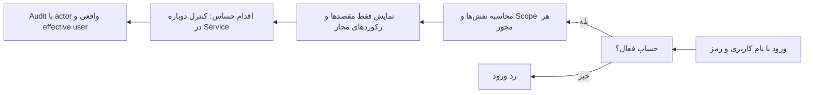
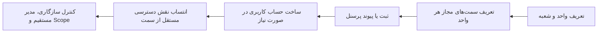
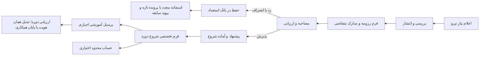
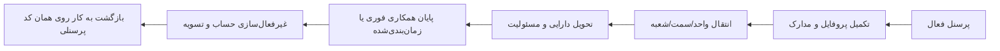
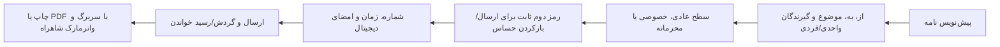
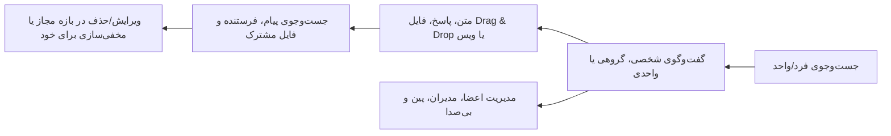
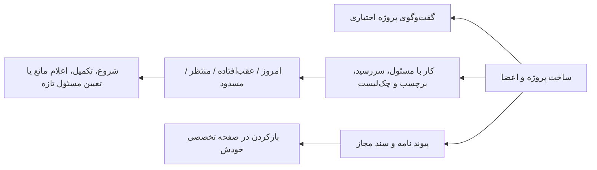
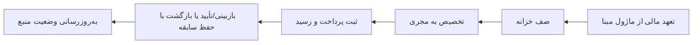
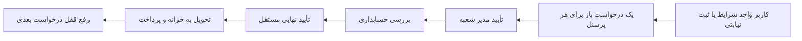
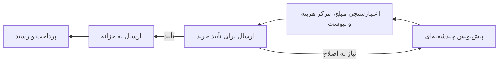

# نقشه فلوهای فعلی شاهراه

**تاریخ ممیزی:** ۱۴۰۵/۰۶/۰۵ — ۲۰۲۶/۰۸/۲۷
**دامنه:** نسخه محلی مرورگر و IndexedDB؛ نه نسخه سروری و چنددستگاهی.

این سند نشان می‌دهد هر کار از کجا شروع می‌شود، از چه مراحلی عبور می‌کند و اکنون تا چه حد قابل استفاده است.

- **Verified (Local-first):** منطق تخصصی، مجوز و تست دارد و در یک مرورگر قابل استفاده است.
- **Implemented-Unverified:** فرم/Store/گردش عمومی دارد، اما هنوز برای استفاده عملیاتی کامل ممیزی تخصصی نشده است.
- **Server-blocked:** برای استفاده واقعی چندکاربره به API، دیتابیس مرکزی یا سرویس بیرونی نیاز دارد.

## ۱. هویت، ورود و دسترسی

- بازیابی رمز با کد محلی نمایشی، رمز دوم چهاررقمی برای نامه حساس، QA access-view فقط‌خواندنی و نقش/Scope چندلایه پیاده شده‌اند.
- تشابه نام هیچ‌وقت هویت را تعیین نمی‌کند؛ User ID، Personnel ID، username و کد پرسنلی مرجع‌اند.
- **وضعیت:** `Verified (Local-first)`. OTP واقعی تا اتصال SMS/Server شبیه‌سازی محلی است.

## ۲. ساختار سازمان، واحد، سمت، شعبه و نقش

- واحد/سمت، مدیر اصلی و جانشین موقت، شعبه، ساختار فروش، کاربران، نقش‌ها و هشدار هویت هم‌نام وجود دارند.
- سمت سازمانی به‌تنهایی مجوز تولید نمی‌کند؛ نقش دسترسی باید جداگانه و مصوب باشد.
- **وضعیت:** هسته سازمان و RBAC `Verified`؛ تکمیل مدیران همه شعب و mapping شغلی تمام واحدهای آینده مرحله‌ای است.

## ۳. جذب، رزومه، بانک استعداد و شروع دوره آموزشی

- متقاضی بدون ورود یا HR می‌تواند فرم رزومه را تکمیل و PDF/تصویر مدارک را نسخه‌دار بارگذاری کند.
- ردشدگان حذف نمی‌شوند و با کد پرونده، نام، موبایل، کد ملی، واحد و مهارت قابل بازیابی‌اند.
- شروع واقعی دوره فقط از command تخصصی اتمیک انجام می‌شود؛ پرسنل اجباری و حساب محدود اختیاری است.
- **وضعیت:** `Verified (Local-first)`.
- **مرحله بعد همین دامنه:** تخصصی‌کردن «تبدیل آموزشی به قراردادی» و «پایان ناموفق دوره» روی همان هویت.

## ۴. پرونده و چرخه عمر پرسنل

- پروفایل، تغییرات در صف بررسی، مدارک نسخه‌دار، جابه‌جایی، پایان/لغو پایان/بازگشت و دارایی‌های در اختیار پیاده شده‌اند.
- افراد هم‌نام با کد پرسنلی، username، واحد و سمت تفکیک می‌شوند.
- **وضعیت:** هسته lifecycle و documents `Verified`؛ onboarding عمومی و قرارداد کامل هنوز `Implemented-Unverified` هستند.

## ۵. نامه‌نگاری و دبیرخانه

- ویرایش تا قبل از اقدام بعدی، گیرندگان فیلترشده با واحد، کپی، پیوست، تاریخچه و چاپ رسمی وجود دارد.
- **وضعیت:** `Verified (Local-first)`.
- امضای حقوقی غیرقابل‌انکار، timestamp authority و ارسال واقعی ایمیل/SMS نیازمند Server/PKI است.

## ۶. گفت‌وگوی شخصی، گروهی و واحدی

- پیش‌نویس هر گفتگو حفظ می‌شود، فرم‌های dirty هشدار دارند و کنترل‌ها permission-aware هستند.
- **وضعیت:** `Verified (Local-first)`.
- **Server-blocked:** پیام زنده بین دستگاه‌ها، presence، push، فایل مرکزی و تماس آنلاین.

## ۷. هاب همکاری، پروژه و کارها

- حذف عضو، کارهای فعال او را وارد صف تعیین تکلیف می‌کند. چند مسئول یعنی چند Task مستقل با batch مشترک.
- عضویت پروژه مجوز نامه، سند یا Chat را تولید نمی‌کند؛ اشتراک مجوز منبع و عضویت لازم است.
- **وضعیت:** `Verified (Local-first)`؛ همکاری هم‌زمان واقعی `Server-blocked` است.

## ۸. هسته مالی و خزانه

- شماره سند، دوره مالی، جلوگیری از پرداخت تکراری، رسید و projection سانسورشده پیاده شده‌اند.
- **وضعیت:** خزانه و هسته پرداخت `Verified (Local-first)`؛ دفترکل و تطبیق بانکی کامل `Implemented-Unverified/Server-blocked` هستند.

## ۹. مساعده پرسنلی

- eligibility فردی، شعبه، maker/checker، نقش هر مرحله، کارت بانکی پرونده و ثبت نیابتی کنترل می‌شوند.
- پرسنل آموزشی به‌صورت پیش‌فرض واجد شرایط نیست.
- **وضعیت:** `Verified (Local-first)`.

## ۱۰. درخواست خرید

- جمع ردیف‌ها، تخصیص شعبه‌ای، مرکز هزینه، مالک کارت، پیش‌فاکتور، stale version و پیگیری خزانه کنترل می‌شوند.
- **وضعیت:** `Verified (Local-first)`؛ RFQ، مقایسه پیشنهاد، سفارش خرید و سه‌طرفه‌سازی هنوز `Implemented-Unverified` هستند.

## ۱۱. تجربه مشترک رابط کاربری

- جست‌وجوی سراسری مقصدها مسیر «حوزه / بخش / صفحه» را نشان می‌دهد.
- تب‌های شبیه مرورگر، فرم‌های دارای ورودی ثبت‌نشده را محافظت می‌کنند.
- خطاهای فرم در نوار بالای صفحه ردیفی نمایش داده و اولین فیلد ناقص را focus می‌کنند.
- برند شاهراه و دو پالت رنگ مستقل از روشن/تیره/سیستم هستند.
- **وضعیت:** `Verified` برای shell فعال؛ همه ۶۷ ماژول عمومی تخصصی و آماده بهره‌برداری نیستند.

## ترتیب توسعه پیشنهادی بعدی

1. تبدیل یا پایان دوره آموزشی روی همان هویت.
2. قرارداد پرسنلی و onboarding تخصصی بدون ساخت حساب/شخص تکراری.
3. چرخه خرید پس از درخواست: استعلام، پیشنهاد، مقایسه و سفارش.
4. دفترکل و تطبیق خزانه پس از تصویب قرارداد حسابداری.
5. Server/API مرکزی؛ سپس realtime، Object Storage و SMS/OTP واقعی.

## منابع جزئی‌تر

- `docs/product/recruitment-talent-bank-v1.md`
- `docs/product/collaboration-hub-v1.md`
- `docs/product/priority-release-audit.md`
- `docs/product/organization-workflow-v1.34.md`
- `docs/_meta/FEATURE-MATRIX.md`
- `docs/17-DECISIONS.md`
